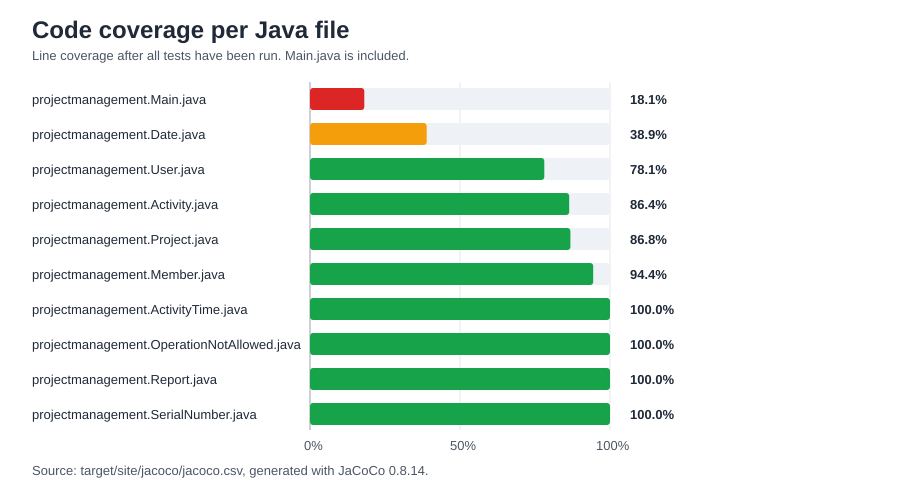

# Code coverage

Efter alle testene er kørt, er code coverage målt med JaCoCo. Rapporten er genereret med kommandoen:

```powershell
mvn clean org.jacoco:jacoco-maven-plugin:0.8.14:prepare-agent test org.jacoco:jacoco-maven-plugin:0.8.14:report
```

Alle 67 tests blev kørt uden fejl. Den samlede linjedækning er 37,6 %, svarende til 254 dækkede linjer ud af 675 linjer. `Main.java` er inkluderet i målingen. De ubrugte `dtu.example.ui`-filer er fjernet og indgår derfor ikke længere i rapporten.



## Code coverage pr. Java-fil

| Java-fil | Dækkede linjer | Linjer i alt | Linjedækning |
|---|---:|---:|---:|
| `projectmanagement.Main.java` | 86 | 475 | 18,1 % |
| `projectmanagement.Date.java` | 7 | 18 | 38,9 % |
| `projectmanagement.User.java` | 25 | 32 | 78,1 % |
| `projectmanagement.Activity.java` | 19 | 22 | 86,4 % |
| `projectmanagement.Project.java` | 59 | 68 | 86,8 % |
| `projectmanagement.Member.java` | 34 | 36 | 94,4 % |
| `projectmanagement.ActivityTime.java` | 8 | 8 | 100,0 % |
| `projectmanagement.OperationNotAllowed.java` | 2 | 2 | 100,0 % |
| `projectmanagement.Report.java` | 6 | 6 | 100,0 % |
| `projectmanagement.SerialNumber.java` | 8 | 8 | 100,0 % |

## Forklaring af resultaterne

Coverage-resultaterne viser, at de centrale domæneklasser i `projectmanagement` generelt er godt dækket af testene. `Activity`, `Project` og `Member` ligger over 85 % linjedækning, hvilket viser, at testene rammer størstedelen af den funktionalitet, som systemets use cases bygger på. `ActivityTime`, `OperationNotAllowed`, `Report` og `SerialNumber` har 100 % linjedækning, men disse klasser er også relativt små, så få tests kan dække hele klassen.

Den samlede coverage trækkes markant ned af `Main.java`, som kun har 18,1 % linjedækning. Filen er inkluderet i rapporten, og den fylder 475 linjer, hvilket betyder, at den vægter meget i det samlede resultat. Den lave dækning skyldes, at `Main.java` primært fungerer som programstart og manuel/sekventiel kørsel, mens testene især fokuserer på domænelogikken.

`Date.java` har også lavere coverage med 38,9 %. Det skyldes især, at ikke alle grene i datologikken bliver testet. Hvis coverage skulle forbedres, ville det være relevant at tilføje tests for flere dato-intervaller og grænsetilfælde.

`User.java` ligger på 78,1 %, hvilket er lavere end flere af de andre domæneklasser, men stadig et rimeligt niveau. De manglende linjer skyldes især metoder eller grene, som ikke bliver ramt af de nuværende tests.

Samlet set viser coverage-rapporten, at domænelogikken er rimeligt godt testet, mens programstart og enkelte grænsetilfælde i datohåndtering har lav dækning. Da `Main.java` er inkluderet, bliver den samlede procent lavere end coverage for de fleste egentlige domæneklasser.
